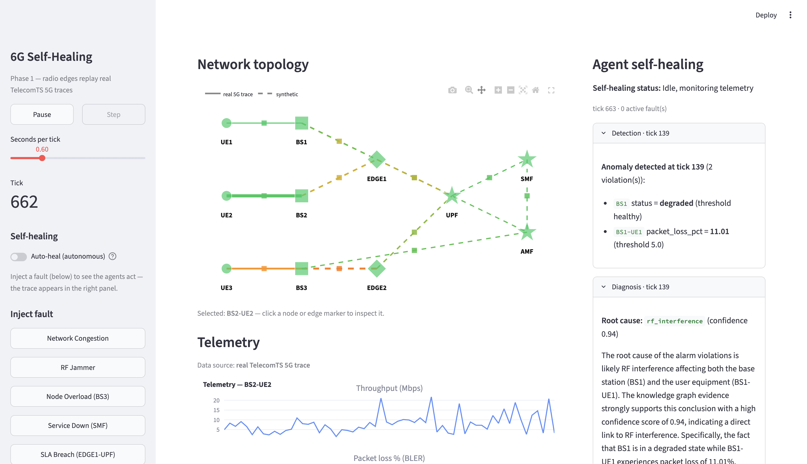

# Self-Healing 6G Network (Proof of Concept)

## Demo

<video src="https://github.com/user-attachments/assets/6e6661b8-ccda-4b2b-a379-904a0fe7e6e4" controls></video>

> The video has audio. Please unmute the player to hear the walkthrough.



[Watch the full demo on YouTube](https://youtu.be/F7ZEzsfiHCE)

## Overview

A proof-of-concept of the multi-agent self-healing architecture from Wu et al. (KDD 2026), built around two infrastructure components: a network digital twin and a telecommunications knowledge graph. The digital twin (NetworkX) streams real 5G telemetry from TelecomTS through a 6G-inspired topology with fault cascade propagation. The knowledge graph (RDFLib + SPARQL) encodes alarm-to-root-cause-to-remediation triples, grounding diagnosis in structured domain knowledge. When a fault fires, four LangGraph-orchestrated agents detect the anomaly, diagnose via the KG, verify the fix against the twin, and execute recovery, with every step visible in a live reasoning trace.

```bash
pip install -r requirements.txt
python -m twin.dataset        # one-time: build the real 5G traces
echo "OPENAI_API_KEY=sk-..." > .env
streamlit run app.py
```

## Data

Radio edges (UE to base-station) replay real 5G KPI traces from the TelecomTS dataset (arXiv:2510.06063), preprocessed into `data/telecomts/*.csv`:

| KPI | Source metric |
|---|---|
| `throughput_mbps` | TX+RX bytes converted to Mbps |
| `packet_loss_pct` | DL BLER |
| `utilization_pct` | PRB utilization |
| `snr_db`, `rsrp_dbm` | UL SNR, RSRP |

Five traces are used: ZoneA/YouTube (normal and jammer), ZoneB/Twitch (normal and congestion), ZoneC/File (normal). Everything else (core functions AMF/SMF/UPF, edge clouds, and backhaul/signaling links) is synthetic. The topology shows the difference: solid lines are real data, dashed lines are synthetic.

## Noise

Synthetic telemetry is not plain Gaussian noise. Telecom traffic is bursty and changes over time, so the generator (`twin/telemetry.py`) layers four effects:

1. Diurnal drift: a slow sine wave that modulates baselines (time-of-day load).
2. Micro-bursts: short spikes on data-plane links, triggered at random.
3. Gaussian jitter: a small ambient noise floor.
4. Correlated degradation: a node's CPU feeds into its links' latency and throughput, so load spreads through the dependency graph. This is how cascades travel.

## Fault Injection Strategy

Five scenarios (`twin/faults.py`), each with a primary effect plus cascades through the dependency graph (the propagation the Diagnosis agent has to untangle):

| Fault | Primary effect | Cascade |
|---|---|---|
| RF Jammer | BS1 to UE1 switches to real jammer trace | CPU load on BS1 spreads to backhaul/N2 |
| Congestion | BS2 to UE2 switches to real congestion trace | CPU load on BS2 spreads to backhaul |
| Node Overload | BS3 CPU/memory spike, sessions rejected | high CPU spreads to its links |
| Service Down | SMF taken down | N4/N11 latency rises, UPF sessions drop |
| SLA Breach | EDGE1 to UPF throughput decays slowly | latency creeps up, no sudden spike |

Every fault flips a node's operational status (degraded or down). This is a clean, reliable signal that anchors detection, because the real radio traces are too noisy for raw KPI thresholds on their own. The affected node also tells the agents exactly where the fault is.

## Agent Architecture

A LangGraph state machine runs the loop once per tick, with a short debounce and a cooldown. Detection and execution are deterministic. Only Diagnosis and Planning use an LLM.

```
Detector  ->  Diagnosis  ->  Planner  ->  Executor  ->  recovery
(rules)       (LLM + KG)     (LLM)        (deterministic)
```

1. Detector (rules): flags threshold violations on the telemetry window, anchored on node status.
2. Diagnosis (LLM + KG): runs a SPARQL match against the knowledge graph (AlarmPattern to RootCause to Remediation), scored on metric and affected-entity overlap. The LLM then explains the evidence.
3. Planner (LLM): logically checks the recommended fix against the dependency graph for side effects, then approves or rejects it.
4. Executor (deterministic): applies the fix to the twin and confirms recovery.

The knowledge graph (`knowledge/`) is RDF triples plus SPARQL. It grounds the diagnosis and drives the inline KG-path visualization. Auto-heal runs the full loop on its own. Manual mode stops after diagnosis so you can approve the fix with one click.

## Tech Stack

| Layer | Tool |
|---|---|
| Digital twin | NetworkX |
| Knowledge graph | RDFLib (RDF + SPARQL) |
| Agent orchestration | LangGraph |
| LLM reasoning | OpenAI `gpt-4o-mini` |
| UI and visualization | Streamlit + Plotly |
| Data | pandas, numpy (TelecomTS traces) |

Pure Python 3.10+, no GPU, runs on a laptop.

## Known Limitations

1. **Pillar 2 only.** This covers the multi-agent self-healing loop. The foundation model (Pillar 1) is not implemented. GPT-4o-mini stands in for what the paper envisions as a telecom-specific model.
2. **Sequential pipeline, not parallel agents.** The paper describes many specialized agents (beamforming, spectrum, charging, slicing) running concurrently with conflict resolution. This implementation runs four agents in a fixed sequence. Only one healing cycle runs at a time.
3. **Simplified twin.** Real 5G telemetry covers three radio edges only. Core network telemetry is synthetic. Fault cascades propagate through CPU-to-link coupling, not full protocol stack simulation.
4. **Five fault scenarios.** The knowledge graph encodes five alarm patterns. A production system would need thousands of failure modes, temporal reasoning over metric sequences, and the security hardening described in Section 4 of the paper.

## Reference

Liang Wu, Kelly Wan, Mayank Darbari, and Liangjie Hong. *Towards Resilient and Autonomous Networks: A BlueSky Vision on AI-Native 6G.* Nokia, Sunnyvale, California, USA. KDD 2026.
